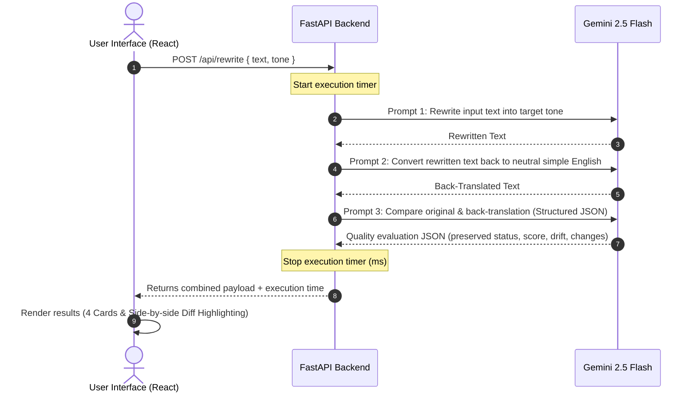

# ToneShift – Audience-Aware AI Rewriter

ToneShift is a modern, responsive AI-powered web application that rewrites user-provided text into different writing tones while validating that the original meaning remains intact. Built as an academic demonstration for AI Engineering, it integrates the Google Gemini API with a Python FastAPI backend and a React + Vite + Tailwind CSS v4 frontend.

---

## 🌟 Key Features

* **Six Targeted Tones**: Supports rewriting into *Formal*, *Casual*, *Professional*, *Friendly*, *Child-Friendly*, and *Academic* tones.
* **Semantic Verification (Back-Translation)**: Automatically translates the rewritten text back into simple, neutral English to check for meaning drift.
* **Meaning Preservation Analysis**: Compares the original text with the back-translated text using Gemini to calculate a **Similarity Score (0-100%)** and identify **Drift Level** ("Low", "Medium", "High").
* **Word-by-word Diff Highlighting**: Features an inline, side-by-side comparative diff engine that colors deleted words in red and inserted words in green.
* **Dynamic Style Shifts ("What Changed?")**: Provides structured explanation bullet points detailing vocabulary, tone, and sentence structure alterations.
* **Premium UX Design**:
  * 🌗 Dark / Light Mode instant theme toggle.
  * 📋 One-click copy to clipboard with toast notifications.
  * 💾 Text file download functionality.
  * ⏱️ Real-time character/word count, estimated reading time, and API response duration tracking.
  * 📱 Fully fluid, mobile-first responsive design.

---

## 🏗️ Architecture & Flow

The following diagram illustrates how text is processed through the ToneShift system:



---

## 💡 Meaning Validation via Back-Translation

### Why Back-Translation?
In traditional text rewriting, measuring whether an AI model preserved the original meaning of a text is difficult because the rewritten text's vocabulary and syntax have changed.

ToneShift solves this by utilizing **Back-Translation**:
1. The **Rewritten Text** (which contains stylized vocabulary/structure) is translated back into simple, flat, neutral English.
2. Since styling elements are stripped away, the **Back-Translation** should theoretically contain the exact same facts, nuances, and flow as the **Original Text**.
3. We then feed both the **Original Text** and the **Back-Translation** into Gemini for a semantic similarity comparison. If any facts were added, lost, or modified during the rewrite process, they will show up as a difference in this neutral comparison, allowing the AI to flag meaning drift.

---

## ✍️ Prompt Engineering Approach

ToneShift separates its AI generation into three modular prompts inside the `backend/services/prompts.py` file to maintain a clean architecture:

1. **Rewrite Prompt**: Establishes strict rules prohibiting the addition of new facts or deletion of info, requiring Gemini to only change vocabulary and style while maintaining the original length.
2. **Back-Translation Prompt**: Directs the model to convert the text back to plain, simple, neutral English, outputting only the plain text result.
3. **Meaning Evaluation Prompt**: Instructs the model to perform a detailed comparison and enforces a structured JSON schema response. We utilize Gemini's native **Structured Outputs** feature (`response_schema`), which guarantees that the JSON format matches our Pydantic schema perfectly, eliminating parsing errors.

---

## 📂 Project Directory Structure

```
tone-shift/
├── backend/
│   ├── api/
│   │   └── routes.py         # POST /api/rewrite route handler & validators
│   ├── services/
│   │   ├── prompts.py        # Central repository for Gemini prompts
│   │   └── gemini.py         # Gemini API calls using google-genai SDK
│   ├── utils/
│   │   └── config.py         # Environment loader (Pydantic Settings)
│   ├── main.py               # FastAPI entry point & CORS configuration
│   └── requirements.txt      # Python dependencies
├── frontend/
│   ├── src/
│   │   ├── components/
│   │   │   ├── ComparisonView.jsx  # Side-by-side word highlighter
│   │   │   ├── OutputCard.jsx      # Exportable text panel with copy/download
│   │   │   ├── QualityAnalysis.jsx # Meter charts & "What Changed?" bullets
│   │   │   └── ToneSelector.jsx    # Target tone card selections
│   │   ├── services/
│   │   │   └── api.js              # API client wrapper
│   │   ├── utils/
│   │   │   └── text.js             # Word count & reading time calculators
│   │   ├── index.css               # Tailwind CSS v4 & custom animations
│   │   ├── main.jsx                # React mount point
│   │   └── App.jsx                 # Core UI orchestrator
│   ├── package.json          # Node dependencies
│   └── vite.config.js        # Vite + Tailwind v4 build settings
├── .env.example              # Environment variables template
└── README.md                 # Project documentation
```

---

## 🚀 Local Installation & Setup

### Prerequisites
* **Python 3.10+** installed.
* **Node.js v18+** and `npm` installed.

---

### 1. Get a Gemini API Key
1. Go to [Google AI Studio](https://aistudio.google.com/).
2. Log in with your Google account.
3. Click **Get API key** and create a new key.
4. Copy the API key.

---

### 2. Backend Setup
1. Open a terminal in the `backend/` directory:
   ```bash
   cd backend
   ```
2. Create and activate a Python virtual environment:
   * **Windows (PowerShell)**:
     ```powershell
     python -m venv venv
     .\venv\Scripts\Activate.ps1
     ```
   * **macOS / Linux**:
     ```bash
     python3 -m venv venv
     source venv/bin/activate
     ```
3. Install dependencies:
   ```bash
   pip install -r requirements.txt
   ```
4. Create a `.env` file in the **root** of the project (`tone-shift/.env`):
   ```env
   GEMINI_API_KEY=your_copied_gemini_api_key_here
   ```
5. Run the backend development server:
   ```bash
   python main.py
   ```
   The backend API will start running at `http://127.0.0.1:8000`.

---

### 3. Frontend Setup
1. Open a new terminal in the `frontend/` directory:
   ```bash
   cd frontend
   ```
2. Install Node packages:
   ```bash
   npm install
   ```
3. Start the Vite React development server:
   ```bash
   npm run dev
   ```
   The frontend application will start running at `http://localhost:5173`. Open this URL in your web browser.

---

## 🛠️ Tech Stack

* **Frontend**: React, Vite, Tailwind CSS v4, Lucide Icons, Diff library
* **Backend**: Python 3, FastAPI, Uvicorn, Pydantic v2 Settings
* **AI Model**: Google Gemini 2.5 Flash (via official `google-genai` SDK)

---

## 🔮 Future Improvements

1. **User Custom Tones**: Allow users to enter a text prompt to define their own custom tone (e.g., "Sarcastic pirate", "Sales pitch").
2. **Context-Aware Vocabulary Suggestions**: Highlight rewritten words and show a tooltip containing alternative synonym suggestions.
3. **Multi-turn Rewrite History**: Cache previous rewrites in local storage to allow users to compare multiple tones side-by-side.
4. **Document Upload**: Support uploading `.txt`, `.docx`, or `.pdf` files to rewrite bulk documents directly.
